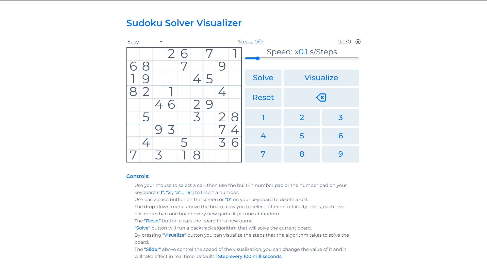
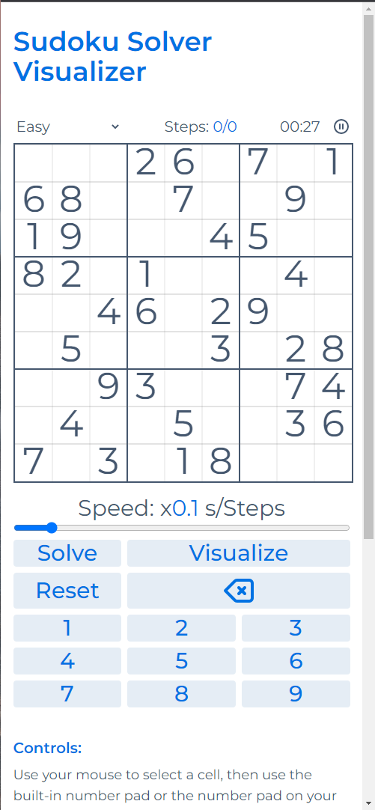

# sudoku-solver-visualizer

**Sudoku Solver Visualizer** is a WebApp made with Vanilla JavaScript.

In this App you can play sudoku as you would do normally, but in a click of button you can solve any board using **BackTrack** algorithm, or even better visualize the steps of the algorithm as it solve the board.

 
### Live Demo: [Sudoku Solver Visualizer]()

https://user-images.githubusercontent.com/82726838/171255187-338c1846-d3f2-4405-b0ea-74bc3b504656.mp4

### How to use:

Use your mouse to select a cell, then use the built-in number pad or the number pad on your keyboard **("1", "2", "3"..., "9")** to Insert a number.

Use backspace button on the screen or **"0"** on your keyboard to delete a cell.

The drop-down menu above the board alow you to select different difficulty levels, each level has more than one board every new game it pic one at random.

The **"Reset"** button clears the board for a new game.
**"Solve"** button will run a backtrack algorithm that will solve the current board.

By pressing **"Visualize"** button you can visualize the steps that the algorithm takes to solve the board.

The **"Slider"** above control the speed of the visualization, you can change the value of it and it will take effect in real time. default: **1 Step every 100 milliseconds**.

### Screenshots:

